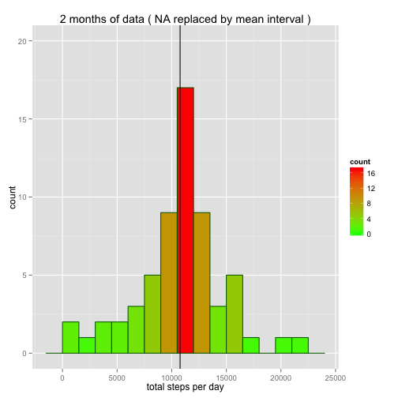

### Loading and preprocessing the data

```r
#cleanup the environment, set working directory to where the data file resides
rm(list=ls(all=TRUE)) 
setwd("~/RepData_PeerAssessment1/")

#load libraries
library(knitr)
library(ggplot2)
library(lubridate)
library(scales)
library(grid)

# load data and check
fulldf <- read.csv("activity.csv", stringsAsFactors = FALSE)
str(fulldf)
```

```
## 'data.frame':	17568 obs. of  3 variables:
##  $ steps   : int  NA NA NA NA NA NA NA NA NA NA ...
##  $ date    : chr  "2012-10-01" "2012-10-01" "2012-10-01" "2012-10-01" ...
##  $ interval: int  0 5 10 15 20 25 30 35 40 45 ...
```

```r
# remove 'steps == NA' from the set and check
# note: if you do 'aggregate(...., na.rm=TRUE)' same result will be achieved: 
# 53 observations to plot
df <- subset(fulldf, !is.na(steps))
str(df)
```

```
## 'data.frame':	15264 obs. of  3 variables:
##  $ steps   : int  0 0 0 0 0 0 0 0 0 0 ...
##  $ date    : chr  "2012-10-02" "2012-10-02" "2012-10-02" "2012-10-02" ...
##  $ interval: int  0 5 10 15 20 25 30 35 40 45 ...
```

```r
#group by date, calculate totals, set column names and check 
result_hist <- aggregate(steps ~ date , data=df, FUN=sum)
colnames(result_hist) <- c("date", "total_steps")
str(result_hist)
```

```
## 'data.frame':	53 obs. of  2 variables:
##  $ date       : chr  "2012-10-02" "2012-10-03" "2012-10-04" "2012-10-05" ...
##  $ total_steps: int  126 11352 12116 13294 15420 11015 12811 9900 10304 17382 ...
```

### What is mean total number of steps taken per day?

```r
# report the mean and median total number of steps taken per day
mean_steps <- as.integer(mean(result_hist$total_steps))
median_steps <- as.integer(median(result_hist$total_steps))
mm <- data.frame(mean=mean_steps, median=median_steps, process="without NA")
mm
```

```
##    mean median    process
## 1 10766  10765 without NA
```

#### histogram
* shows the bins of 1500 steps representing the total ranges, with the frequency/count for the ranges of totals

```r
m <- ggplot(result_hist, aes(x=total_steps))
m + geom_histogram(binwidth=1500, aes(fill = ..count..), colour = "darkgreen") +
        geom_vline(aes(xintercept=mean_steps)) +     
        scale_fill_gradient("count", low = "green", high = "red") +
        ylim(0,20) +
        labs(x = "total steps per day") + 
        labs(y = "count") + 
        labs(title = "2 months of data ( excluding NA values )")
```

 

### What is the average daily activity pattern?

```r
#group by interval, calculate average steps and check
result <- aggregate(steps ~ interval , data=df, FUN=mean)
colnames(result) <- c("interval", "mean_steps")
str(result)
```

```
## 'data.frame':	288 obs. of  2 variables:
##  $ interval  : int  0 5 10 15 20 25 30 35 40 45 ...
##  $ mean_steps: num  1.717 0.3396 0.1321 0.1509 0.0755 ...
```

```r
#add new variable and set it to sequence of consecutive integers to plot correctly 
# knowing that interval is sorted
result$seq_interval <- 1:288
colnames(result) <- c("interval", "mean_steps", "seq_interval")

#scale claculation for x-axis: 288 intervals / 24 hours = 12 intervals in one hour
# if we want to plot "3:00","8:00","13:00","18:00","23:00" 
# then the corresponding ints will be 36,96,156,216,276 respectively

#finding 5-minute interval that contains the maximum number of steps
result[result$mean_steps == max(result$mean_steps),]
```

```
##     interval mean_steps seq_interval
## 104      835   206.1698          104
```

#### plot
* shows time series of the 5-minute interval (x-axis) and the average number of steps taken, averaged across all days (y-axis)
* demonstrates how the monitored activity is distributed during the 24h period

```r
with(result, {
        par(mar=c(5,5,4,2))
        plot(seq_interval, mean_steps, xlab = "", ylab = "", type = "l", 
             axes=FALSE, main="Average steps per interval")
        
        axis(side=1, at = c(36,96,156,216,276), 
             labels = c("3:00","8:00","13:00","18:00","23:00"))
        
        axis(side=2, at = c(0,50,100,150,200), las=2)
        box()
        mtext("average steps",side=2,line=4)
        mtext("5-min intervals",side=1,line=3)
        
        text(200, 180, "interval 8:35 contains max steps: 206", col="red")
})
```

 

### Imputing missing values

```r
# create subset containing missing values to report total number of missing values 
# ( number of observations )
missing_values <- subset(fulldf, is.na(steps))
str(missing_values)
```

```
## 'data.frame':	2304 obs. of  3 variables:
##  $ steps   : int  NA NA NA NA NA NA NA NA NA NA ...
##  $ date    : chr  "2012-10-01" "2012-10-01" "2012-10-01" "2012-10-01" ...
##  $ interval: int  0 5 10 15 20 25 30 35 40 45 ...
```

```r
# display records with missing values for interval == 0
fulldf[fulldf$interval == 0 & is.na(fulldf$steps),]
```

```
##       steps       date interval
## 1        NA 2012-10-01        0
## 2017     NA 2012-10-08        0
## 8929     NA 2012-11-01        0
## 9793     NA 2012-11-04        0
## 11233    NA 2012-11-09        0
## 11521    NA 2012-11-10        0
## 12673    NA 2012-11-14        0
## 17281    NA 2012-11-30        0
```

```r
# display mean for interval == 0
result[result$interval == 0,]
```

```
##   interval mean_steps seq_interval
## 1        0   1.716981            1
```

```r
# we could replace missing values in steps with the mean for that 5-minute interval: 
# logic will loop through interval and set steps == NA to the mean for that 5-minute interval 
# to see what effect this will make on the data distribution
for (i in result$interval ) {
        index <- is.na(fulldf$steps) & fulldf$interval == i
        fulldf$steps[index] <- result[result$interval == i,2]        
} 

# data no longer contains NA:
all(colSums(is.na(fulldf)) == 0)
```

```
## [1] TRUE
```

```r
# check the correctness of the replacement for two random days: 2012-10-01 and 2012-11-30
fulldf[fulldf$interval == 0 & (fulldf$date == "2012-10-01" | fulldf$date == "2012-11-30"),]
```

```
##          steps       date interval
## 1     1.716981 2012-10-01        0
## 17281 1.716981 2012-11-30        0
```

```r
# group the enhanced data set by date, calculate total steps, set column names and check
enhanced_result <- aggregate(steps ~ date , data=fulldf, FUN=sum)
colnames(enhanced_result) <- c("date", "total_steps")
str(enhanced_result)
```

```
## 'data.frame':	61 obs. of  2 variables:
##  $ date       : chr  "2012-10-01" "2012-10-02" "2012-10-03" "2012-10-04" ...
##  $ total_steps: num  10766 126 11352 12116 13294 ...
```


```r
# report mean and median and show how they differ from the estimates 
# in the the first part of the assignment
mean_steps <- as.integer(mean(enhanced_result$total_steps))
median_steps <- as.integer(median(enhanced_result$total_steps))
mm <- rbind(mm, data.frame(mean=mean_steps, median=median_steps, process="replaced NA"))
mm
```

```
##    mean median     process
## 1 10766  10765  without NA
## 2 10766  10766 replaced NA
```
#### histogram
* shows a major increse in the frequency/count for range of totals: 10,500 - 12,000
* demonstates that the initial data with missing values introduced bias into the calculations of totals


```r
m <- ggplot(enhanced_result, aes(x=total_steps))
m + geom_histogram(binwidth=1500, aes(fill = ..count..), colour = "darkgreen") +
        geom_vline(aes(xintercept=mean_steps)) +   
        scale_fill_gradient("count", low = "green", high = "red") +
        ylim(0,20) +
        labs(x = "total steps per day") + 
        labs(y = "count") + 
        labs(title = "2 months of data ( NA replaced by mean interval )")
```

 


```r
# combine two data frames into one to plot 2 histograms on the same plot 
# and set new factor variable 
result_hist$process <- as.factor(c("without NA")) 
enhanced_result$process <- as.factor(c("replaced NA"))

# check the new data set
twohist <- as.data.frame(rbind(result_hist, enhanced_result))
colnames(twohist) <- c("date", "total_steps", "process")
head(twohist,3)
```

```
##         date total_steps    process
## 1 2012-10-02         126 without NA
## 2 2012-10-03       11352 without NA
## 3 2012-10-04       12116 without NA
```

```r
tail(twohist,3)
```

```
##           date total_steps     process
## 112 2012-11-28    10183.00 replaced NA
## 113 2012-11-29     7047.00 replaced NA
## 114 2012-11-30    10766.19 replaced NA
```

#### two overlapping histograms to show the bias

```r
m <- ggplot(twohist, aes(x=total_steps, fill=process)) 
m + geom_histogram(binwidth=1500, alpha = 0.5, 
                   position = "identity", colour = "darkgreen") +
        
        geom_vline(aes(xintercept=mean_steps)) +   
        ylim(0,20) +
        
        annotate("text", label = "<--- overlap", x = 18000, y = 10, 
                 size = 8, colour = "red", angle=45) +
        labs(x = "total steps per day") + 
        labs(y = "count")
```

 

### Are there differences in activity patterns between weekdays and weekends?

```r
# clenup variables
rm(index)
rm(result)

# generate index and set new factor() variable: day_type
index <- weekdays(ymd(fulldf$date)) == "Sunday" | weekdays(ymd(fulldf$date)) == "Saturday"
fulldf$day_type[index] <- "weekend"   
fulldf$day_type[!index] <- "weekday"

fulldf$day_type <- as.factor(fulldf$day_type)

# group by daty_type and interval, calculate the average
result <- aggregate(steps ~ day_type * interval, data=fulldf, FUN=mean)
colnames(result) <- c("day_type", "interval", "mean_steps")

#since the interval is sorted we could create a repeating sequence and set seq_interval
result$seq_interval <- rep(seq(1:288), each=2)      
head(result)
```

```
##   day_type interval mean_steps seq_interval
## 1  weekday        0 2.25115304            1
## 2  weekend        0 0.21462264            1
## 3  weekday        5 0.44528302            2
## 4  weekend        5 0.04245283            2
## 5  weekday       10 0.17316562            3
## 6  weekend       10 0.01650943            3
```

```r
# generate subsets for setting color on separate panels
wday <- subset(result, day_type == "weekday")
wend <- subset(result, day_type == "weekend")
```

#### panel plot
* shows time series plot of the 5-minute interval (x-axis) and the average number of steps taken, averaged across all weekday days or weekend days (y-axis)
* shows how the activity over the weekend is distributed more evenly during the day

```r
p <- ggplot(result, aes(x=seq_interval, y=mean_steps))
p + facet_wrap(~ day_type, nrow = 2, ncol = 1) +
        geom_line(data = wday, colour = "red") +
        geom_line(data = wend, colour = "blue") +

        theme(panel.background = element_rect(fill = 'gray'), 
              plot.margin = unit(c(4,4,6,4),"mm"),
              strip.text.x = element_text(size=12, face="bold")) +     

        labs(x = "5-min intervals") + 
        labs(y = "average steps") + 
        labs(title = "Average steps per interval") +       
        scale_x_continuous(breaks = c(36,96,156,216,276), 
                           labels = c("3:00","8:00","13:00","18:00","23:00"))
```

 
